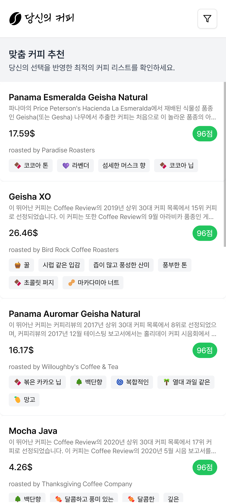
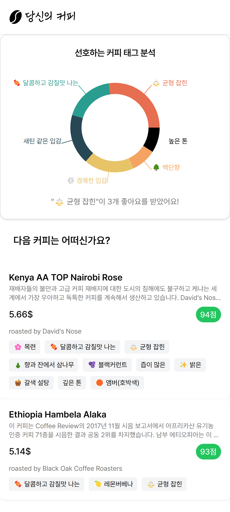
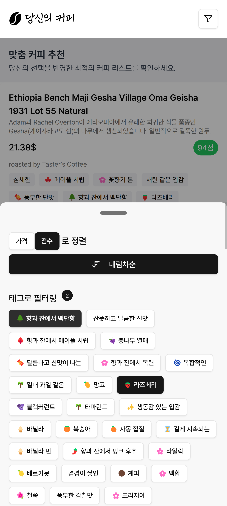
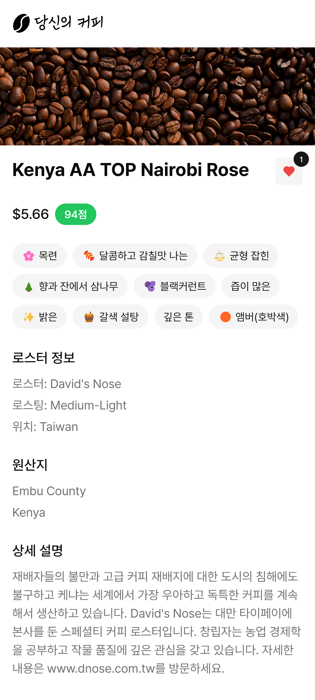

# 당신의 커피 (Your Coffee)

커피 취향을 발견하고, 다양한 커피 데이터를 탐색하며, 나만의 커피를 추천해주는 서비스입니다.

## 주요 기능

- 커피 데이터 탐색

  - 다양한 커피 목록을 제공하며, 상세한 커피 정보를 확인할 수 있습니다.
  - 무한 스크롤과 윈도윙(windowing) 최적화를 통해 성능 저하 없이 부드러운 탐색이 가능합니다.

- 좋아요 및 태그 기반 추천:

  - 사용자는 커피에 '좋아요'를 누를 수 있으며, 이를 기반으로 개인화된 커피 태그 선호도를 분석하여 추천합니다.

- 필터링 및 정렬:

  - 다양한 태그와 조건(가격, 평점 등)을 기반으로 커피를 필터링하고 정렬할 수 있습니다.

- 커피 상세 정보:

  - 커피에 대한 상세 설명, 원산지, 로스터 정보, 향미 노트 등 심층적인 데이터를 제공합니다.

## 기술 스택

- 프론트엔드
  - Vite, React, Apollo Client, shadcn ui
- 백엔드
  - Express, GraphQL, Prisma

## 데이터

- [공개된 캐글의 데이터셋](https://www.kaggle.com/datasets/schmoyote/coffee-reviews-dataset)을 가공해서 사용했습니다.
